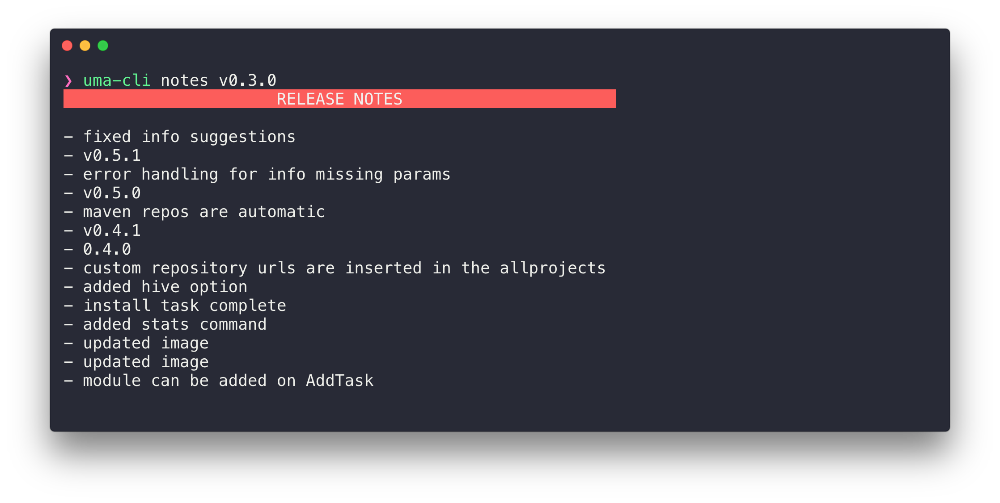

# release-notes
> Tool to get release notes based on commit messages

<p align="center">

</p>


## Install

```sh
npm install
npm link
```

## Usage

```
Usage

   $ release <command> <params>

   $ release notes <FROM> <TO>             # Commits from <FROM> to <TO>
   
 Examples

   $ release notes PR11 PR12               # Commits from PR11 to PR12
   $ release notes PR11                    # Commits from PR11 to HEAD
   $ release notes 922a67d566              # Commits from 922a67d566 to HEAD
```

## Created by
[Cesar Ferreira](https://cesarferreira.com)

## License
MIT © [Cesar Ferreira](http://cesarferreira.com)
